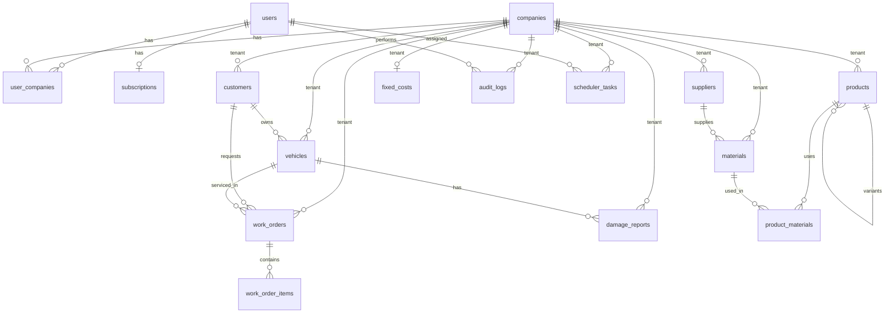

# TallerPlus Database Study

A concise reference for the **TallerPlus** backend (auto repair shop management), based on the TypeORM entities in this project.

---

## 1. Overview

The database supports a **multi-tenant SaaS** model:

- **Users** authenticate and may belong to one or more **companies** (workshops).
- Each **company** is a tenant; most business data is scoped via `tenant_id`.
- Core workflow: **Customer** → **Vehicle** → **Work Order** → **Work Order Items** (services/materials).
- Supporting modules: inventory, products, suppliers, damage reports, finance, subscriptions, audit, and scheduling.

---

## 2. Common Base (`BaseEntity`)

Every entity inherits:

| Column       | Type     | Description              |
|-------------|----------|--------------------------|
| `id`        | UUID     | Primary key              |
| `created_at`| timestamp| Record creation time     |
| `updated_at`| timestamp| Last update time         |

---

## 3. Multi-Tenancy Pattern

| Pattern | Tables |
|---------|--------|
| `tenant_id` → `companies.id` | customers, vehicles, work_orders, products, materials, suppliers, damage_reports, fixed_costs, audit_logs, scheduler_tasks |
| Junction table | `user_companies` (user ↔ company) |
| User-scoped (not tenant) | `users`, `subscriptions` |

---

## 4. Entity Reference by Domain

### 4.1 Identity & Access

#### `users`
Platform users (login accounts).

| Column        | Type    | Notes                          |
|---------------|---------|--------------------------------|
| first_name    | string  |                                |
| last_name     | string  |                                |
| password      | string  | Hidden from default SELECT     |
| email         | string  | Required                       |
| phone         | string  | Required                       |
| address       | string  | Optional                       |
| country       | string  | Optional                       |
| timezone      | string  | Default: `America/Montevideo`  |
| preferences   | jsonb   | User settings                  |
| role          | string  | Default: `CUSTOMER`            |

#### `user_companies`
Many-to-many: users ↔ companies.

| Column     | Type   | Notes                    |
|------------|--------|--------------------------|
| user_id    | UUID   | FK → users               |
| company_id | UUID   | FK → companies           |
| role       | string | Default: `GUEST` (OWNER, GUEST) |

#### `subscriptions`
One subscription per user (SaaS billing).

| Column             | Type      | Notes                              |
|--------------------|-----------|------------------------------------|
| user_id            | UUID      | FK → users (OneToOne)              |
| tier               | enum      | `free`, `premium`, `special`       |
| status             | enum      | `active`, `pending`, `expired`, `trial` |
| last_amount        | float     | Last payment amount                |
| last_payment_date  | timestamp |                                    |
| valid_until        | timestamp | Subscription expiry                |
| external_reference | string    | Payment provider reference         |

---

### 4.2 Organization

#### `companies`
Workshop / tenant root.

| Column                 | Type   | Notes                    |
|------------------------|--------|--------------------------|
| name                   | string | Workshop name            |
| logo                   | string | Optional                 |
| location               | string |                          |
| phone                  | string | Optional                 |
| rut                    | string | Tax ID (optional)        |
| currency               | string | Default: `UYU`           |
| monthly_working_hours  | number | Default: 0               |
| metadata               | jsonb  | Extra config             |

---

### 4.3 CRM (Customers & Vehicles)

#### `customers`
End clients of a workshop.

| Column          | Type   | Notes              |
|-----------------|--------|--------------------|
| tenant_id       | UUID   | FK → companies     |
| full_name       | string |                    |
| document_type   | string | Optional           |
| document_number | string | Optional           |
| email           | string | Optional           |
| phone           | string | Optional           |
| address         | string | Optional           |
| metadata        | jsonb  |                    |

**Relations:** belongs to Company; has many Vehicles.

#### `vehicles`
Cars owned by customers.

| Column     | Type     | Notes              |
|------------|----------|--------------------|
| tenant_id  | UUID     | FK → companies     |
| plate      | string   | License plate      |
| padron     | string   | Vehicle registry   |
| brand      | string   |                    |
| model      | string   |                    |
| year       | number   | Optional           |
| vin        | string   | Optional           |
| color      | string   | Optional           |
| client_id  | UUID     | FK → customers     |
| photos     | jsonb[]  | Default: []        |
| documents  | jsonb[]  | Default: []        |
| metadata   | jsonb    |                    |

**Relations:** belongs to Company and Customer; has many DamageReports.

---

### 4.4 Work Orders (Core Business)

#### `work_orders`
Repair/service jobs.

| Column                  | Type      | Notes                          |
|-------------------------|-----------|--------------------------------|
| tenant_id               | UUID      | FK → companies                 |
| vehicle_id              | UUID      | FK → vehicles                  |
| customer_id             | UUID      | FK → customers                 |
| order_number            | string    | Human-readable ID              |
| status                  | enum      | See status flow below          |
| description             | text      | Customer-facing description    |
| diagnosis               | text      | Technical diagnosis            |
| internal_notes          | text      | Staff-only notes               |
| mileage                 | number    | Odometer reading               |
| estimated_delivery_date | timestamp |                                |
| actual_delivery_date    | timestamp |                                |
| assigned_to_id          | UUID      | Assigned technician (no FK in entity) |
| subtotal                | float     | Default: 0                     |
| tax_percent             | float     | Default: 0                     |
| discount_amount         | float     | Default: 0                     |
| total                   | float     | Default: 0                     |

**Work order status flow:**

```
pending → in_progress → waiting_parts → completed → delivered
                                              ↘ cancelled
```

| Status          | Meaning                    |
|-----------------|----------------------------|
| `pending`       | Created, not started       |
| `in_progress`   | Work in progress           |
| `waiting_parts` | Blocked on parts           |
| `completed`     | Work done                  |
| `delivered`     | Returned to customer       |
| `cancelled`     | Cancelled                  |

#### `work_order_items`
Line items on a work order.

| Column           | Type   | Notes                              |
|------------------|--------|------------------------------------|
| work_order_id    | UUID   | FK → work_orders (CASCADE delete)  |
| item_type        | enum   | `service`, `material`, `other`     |
| product_id       | UUID   | Optional link to products          |
| material_id      | UUID   | Optional link to materials         |
| description      | string | Line description                   |
| quantity         | float  | Default: 1                         |
| unit_price       | float  | Default: 0                         |
| discount_percent | float  | Default: 0                         |
| subtotal         | float  | Default: 0                         |

---

### 4.5 Catalog & Inventory

#### `products`
Services / sellable items (can have variants).

| Column         | Type     | Notes                    |
|----------------|----------|--------------------------|
| tenant_id      | UUID     | FK → companies           |
| title          | string   |                          |
| price          | float    |                          |
| currency_rate  | float    | Default: 1               |
| categories     | string[] |                          |
| materials      | jsonb    | Legacy/embedded materials|
| photos         | string[] |                          |
| parent_id      | UUID     | Self-FK for variants     |
| profit_margin  | number   | Default: 10              |
| labor_hours    | number   | Default: 0               |

**Relations:** self-referencing parent/variants; belongs to Company.

#### `materials`
Raw materials / parts in inventory.

| Column      | Type   | Notes              |
|-------------|--------|--------------------|
| tenant_id   | UUID   | FK → companies     |
| title       | string |                    |
| unit_cost   | float  |                    |
| unit_type   | string | e.g. kg, unit, L   |
| supplier_id | UUID   | FK → suppliers     |
| metadata    | jsonb  |                    |

#### `product_materials`
Bill of materials: which materials a product uses.

| Column         | Type  | Notes                    |
|----------------|-------|--------------------------|
| product_id     | UUID  | FK → products (CASCADE)  |
| material_id    | UUID  | FK → materials           |
| quantity_used  | float | e.g. 0.5 kg              |

#### `suppliers`
Material vendors.

| Column       | Type   | Notes              |
|--------------|--------|--------------------|
| tenant_id    | UUID   | FK → companies     |
| name         | string |                    |
| contact_name | string | Optional           |
| phone        | string | Optional           |
| email        | string | Optional           |
| location     | string | Optional           |
| metadata     | jsonb  | Key-value pairs    |

**Relations:** has many Materials.

---

### 4.6 Damage Reports

#### `damage_reports`
Vehicle damage documentation (insurance/claims).

| Column          | Type      | Notes                                      |
|-----------------|-----------|--------------------------------------------|
| tenant_id       | UUID      | FK → companies                             |
| vehicle_id      | UUID      | FK → vehicles (CASCADE)                    |
| report_number   | string    | Optional                                   |
| description     | text      |                                            |
| damage_location | string    | Where on the vehicle                       |
| severity        | enum      | `minor`, `moderate`, `severe`, `total_loss`|
| damage_details  | text      |                                            |
| status          | enum      | `pending` → `in_review` → `approved`/`rejected` → `completed` |
| estimated_cost  | decimal   |                                            |
| reported_by     | string    |                                            |
| report_date     | timestamp | Default: now                               |
| photos          | jsonb     | Default: []                                |
| metadata        | jsonb     |                                            |

---

### 4.7 Finance

#### `fixed_costs`
Monthly fixed expenses per company (OneToOne with company).

| Column      | Type  | Notes                    |
|-------------|-------|--------------------------|
| tenant_id   | UUID  | FK → companies           |
| electricity | float |                          |
| water       | float |                          |
| gas         | float |                          |
| internet    | float |                          |
| others      | jsonb | `{ titule, cost }[]`     |

---

### 4.8 System & Operations

#### `audit_logs`
Activity trail per tenant.

| Column    | Type   | Notes              |
|-----------|--------|--------------------|
| tenant_id | UUID   | FK → companies     |
| code      | string | Event code         |
| event     | string | Event description  |
| user_id   | UUID   | FK → users         |

#### `scheduler_tasks`
Scheduled reminders and notifications.

| Column          | Type      | Notes                    |
|-----------------|-----------|--------------------------|
| tenant_id       | UUID      | FK → companies           |
| user_id         | UUID      | FK → users               |
| execution_date  | timestamp | When to run              |
| description     | string    |                          |
| action          | enum      | `agenda`, `notification` |
| message         | text      | Content to send/show     |

---

## 5. Entity Relationship Diagram



---

## 6. Table Summary (16 tables)

| # | Table              | Purpose                          |
|---|--------------------|----------------------------------|
| 1 | users              | Authentication & profiles        |
| 2 | user_companies     | User ↔ Company membership        |
| 3 | subscriptions      | SaaS billing per user            |
| 4 | companies          | Tenant / workshop                |
| 5 | customers          | Workshop clients                 |
| 6 | vehicles           | Customer vehicles                |
| 7 | work_orders        | Repair jobs                      |
| 8 | work_order_items   | Line items on orders             |
| 9 | products           | Services & catalog               |
| 10| materials          | Inventory parts                  |
| 11| product_materials  | Product BOM                      |
| 12| suppliers          | Vendors                          |
| 13| damage_reports     | Vehicle damage records           |
| 14| fixed_costs        | Monthly overhead                 |
| 15| audit_logs         | Audit trail                      |
| 16| scheduler_tasks    | Scheduled tasks                  |

---

## 7. Key Design Notes

1. **Tenant isolation:** Almost all business data uses `tenant_id` → `companies.id`.
2. **Soft links:** `work_orders.assigned_to_id` and `work_order_items.product_id` / `material_id` are UUIDs without explicit FK relations in the entities.
3. **Product variants:** `products.parent_id` enables a parent/variant hierarchy.
4. **Dual material model:** Products have both a `materials` jsonb field and a normalized `product_materials` junction table.
5. **Cascades:** Deleting a work order deletes its items; deleting a vehicle deletes its damage reports.
6. **Default locale:** Uruguay-focused defaults (`UYU`, `America/Montevideo`, `rut`, `padron`).

---

## 8. Typical Data Flow

```
User signs up
  → Subscription created (tier/status)
  → User joins Company via user_companies (OWNER/GUEST)

Workshop operations:
  Company
    → Customer registered
      → Vehicle added
        → Work Order opened (status: pending)
          → Items added (service/material/other)
          → Status progresses → completed → delivered
        → Damage Report (optional, parallel track)

Catalog setup:
  Supplier → Material → ProductMaterial → Product (service with BOM)
```
